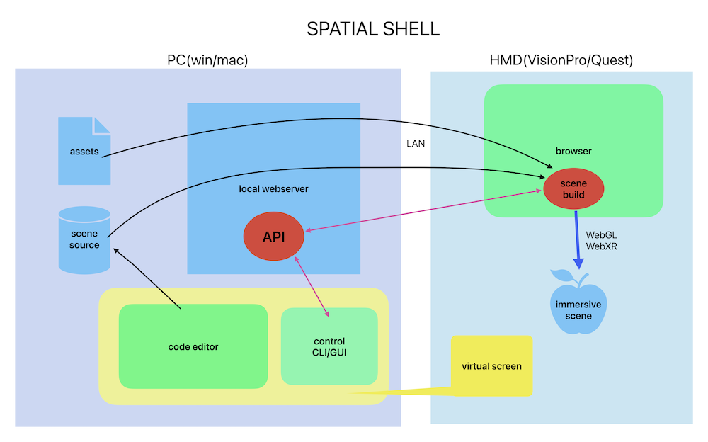
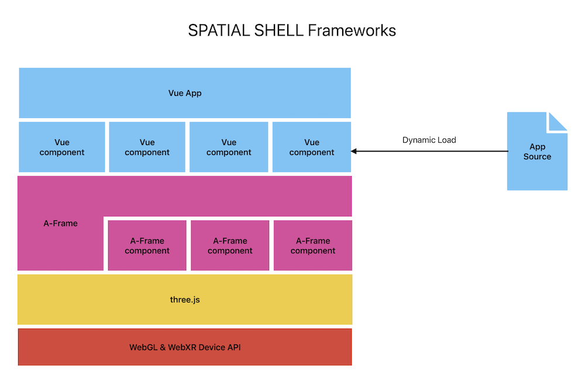

# SPATIAL SHELL

## about 

SPATIAL SHELL is playground for WebXR.

With SPATIAL SHELL, you can develop WebXR applications on Mac/Win and run them on the HMD's browser.

Each app can be created as a file containing a template and JavaScript code, and then launched with a command.

SPATIAL SHELL has the following characteristics

 - Development PC/Mac + HMD combination
 - Thoughts on CLI shell
 - Web standard multi-platform
 - Does not depend on specific web services
 - A simple environment where you can write a program and run it.

Currently, operation has been confirmed with VisionPro and MetaQuest3 .

## guide 

Read first.

[SPATIAL SHELLスタートアップガイド](https://note.com/wakufactory/n/na57d51909ab9)  (japanese)

## files
```
┣ server.js (server program Runs on Node.js)  
┗ dist  
  ┣ cmd.sh (command script for mac)  
  ┣ cmd.ps1 (command script for win(powershell))  
  ┗ html  
    ┣ index.html (document root)  
    ┣ playground.html (main html for HMD)  
    ┣ apps (apps folder)  
    ┣ assets (assets folder)  
    ┗ js (javascript libs)  
```
## command

Control by entering commands from the Mac/PC command line. Use cmd.sh (mac) or cmd.ps1 (win) for commands.

example:

```
> ./cmd.sh open clock.js
```
this open clock.js app.

commands:

|Command|Usage|Description|
|:---:|:---|:---|
|open|open [appname]| open app|
|edit|edit [appname]| open app for edit|
|procs|procs pp| show running apps|
|kill| kill [pid]| delete the specified app|
|param|param [pid] [key]=[value]| set params to app|
|clear|clear|remove all apps|
|env | env [cat] [param] | set env|
|savestat| savestat [file] | save status |
|loadstat| loadstat [file] | load status |

common params for app: 

|Param|Usage|Description|
|:---:|:---|:---|
|basescale| basescale=0.1 | scaling |
|grabbable| grabbable=false | set grabbable |
|posX| posX=2 | set fixed position X |
|posY| posY=2 | set fixed position Y |
|posZ| posZ=2 | set fixed position Z |
|rotX| rotX=10 | set fixed rotation X (degree) |
|rotY| rotY=10 | set fixed rotation Y (degree) |
|rotZ| rotZ=10 | set fixed rotation Z (degree) |

## apps

Sample apps.
|App|Usage|Description|
|:---:|:---|:---|
|clock|clock|simple clock|
|glbmodel|glbmodel psrc=[source]| open glb model|
|image2D|image2D psrc=[source]| open 2D image|
|image360|image360 psrc=[source]| open 360 image(Equirectangular)|
|plymodel|plymodel psrc=[source]| open gaussian splatting(ply)|
|sample/basic|sample/basic| basic template|
|sample/nocode|sample/nocode| nocode sample|
|sample/instobj1|sample/instobj1| object with instancing |
|sample/pmesh| sample/pmesh| mesh moving sample |


## structure

The SPATIAL SHELL mechanism is to run a local web server on Mac/Win and access it using the HMD's browser.

At the same time, use screen sharing on the HMD to operate the WebXR app from your Mac/PC.



The application framework that runs on the browser uses Vue and A-Frame.

The WebXR app consists of a Vue template and A-Frame components.



## credits

 - GaussianSplats3D : (https://github.com/mkkellogg/GaussianSplats3D)
 - 3Dmodel lycoris source:
(https://sketchfab.com/3d-models/red-spider-lily-lycoris-radiata-3595e743a5b64d8699fac6dcf4af3f4f)

 - all sample photos: by wakufactory 


